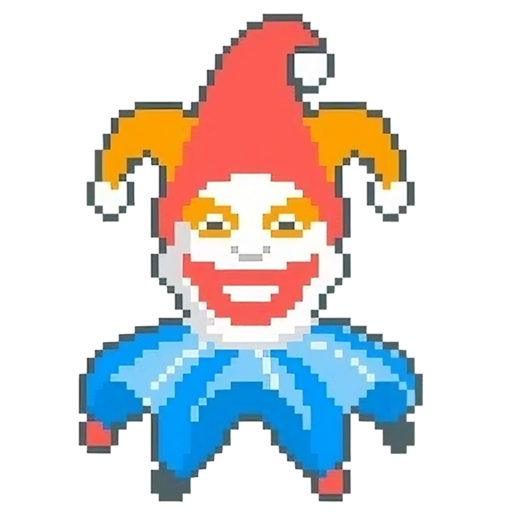

<p align="center">
  
</p>


# Balatro Run Music
Generates the background music (no sound effects) of a random Balatro run using a combination of the five themes: `Main Theme`, `Shop Theme`, `Tarot Pack Theme`, `Planet Pack Theme`, `Boss Blind Theme`. 

The generation follows the game logic.

## Usage and sample output: `balatro.mp3`

Usage: `python balatro.py`

There is a sample MP3 file with this random run with Ante 8/8 in 16 minutes 46 seconds.
```
$ python balatro.py

Creating run...
  > Duration: 00:16:46
  > Ante: 8/8
  > Round: 22
  > Card packs: 2
  > Joker packs: 10
  > Tarot packs: 4
  > Planet packs: 5
Creating track...
Completed!
```


## File requirements

Looks like the joke's on us! Unfortunately, I cannot share the audio files. But, they are expected to be in the `./tracks` directory:
```
./tracks/01. Main Theme.mp3
./tracks/02. Shop Theme.mp3
./tracks/03. Tarot Pack Theme.mp3
./tracks/04. Planet Pack Theme.mp3
./tracks/05. Boss Blind Theme.mp3
```
#### Where to get the files?
I'm literally a fool, what's your excuse?

## Logic explanation (for the Blueprint Jokers)
There is a simplified "Game State" to track the current state (music to be played) along with the duration of the music segment and the next game state to follow. The choices of the music duration and the next game state are all randomly selected from a set or range of choices.

Main game states: `Pick`, `Round`, `Shop`, `Pack`.

Along with other information like the subtype (e.g. `TarotPack` or `JokerPack`) and the blind (e.g. `Small`, `Big`, `Boss`).

#### For example:

The game starts with a `Pick` which represents the Blind Pick state. Here, the player can only choose one of `{Round, Pick}` which represent either playing the `Round` or skipping to the next `Pick`.

The probailities of picking (at this current stage of development) is PRE-DEFINED and FIXED probabilities (e.g. 95% chance to choose `Round` and 5% chance to choose `Pick`).

#### Another example:

In a `JokerPack` state, the player can ONLY progress to the `Shop` state which is exiting the joker pack selection screen. For this, there is only one choice `{Shop}` with a 100% probability.

#### Summary of all possible state movement
```
Pick -> {Round, Pick}
Round -> {Shop, END}
Shop -> {TarotPack, CardPack, JokerPack, PlanetPack}
*Pack -> {Shop}
```
where `END` indicates the player losing and the music ends. Currently, the `None` type is being used to represent this state.

#### Mapping of game state to theme
Main Theme: `Pick`, `Round`

Shop Theme: `Shop`

Tarot Pack Theme: `TarotPack`, `JokerPack`, `CardPack`

Planet Pack Theme: `PlanetPack`

Boss Blind Theme: `Round(Boss)`


